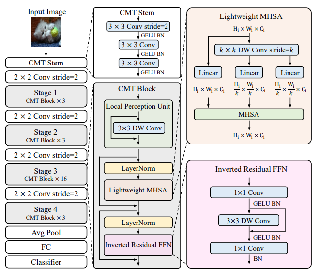
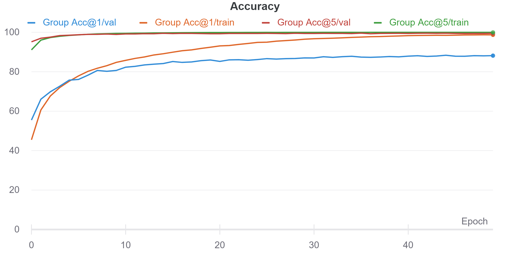
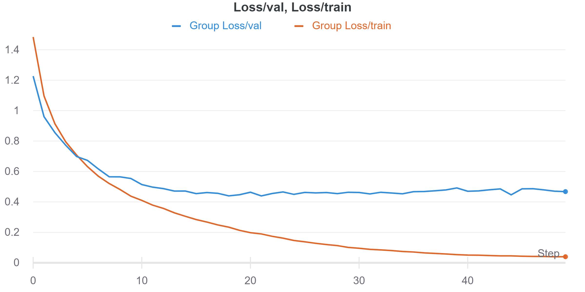

# CMT: Convolutional Neural Networks Meet Vision Transformers

A PyTorch implementation of CMT based on paper [CMT: Convolutional Neural Networks Meet Vision Transformers](https://arxiv.org/abs/2107.06263v2).


<p align=center><b>Network Overview</b></p>

---


<p align=center><b>CMT variants structure overview</b></p>

---
## Number of Parameters
|Model  |  # Params of the paper    | # Parames of this implement | MACs(G) |
|-------|:-------------------------:|:---------------------------:|:-------:|
|CMT-Ti |         9.49 M            |         10.32 M             |  1.21   |
|CMT-XS |        15.24 M            |         16.40 M             |  2.04   |
|CMT-S  |        25.14 M            |         27.38 M             |  3.88   |
|CMT-B  |        45.72 M            |         47.06 M             |  6.83   |

---

## Usage
### Training
```bash=
python main.py
```

```bash=
optional arguments:
  -h, --help            show this help message and exit
  --gpu_device GPU_DEVICE
                        Select specific GPU to run the model
  --batch-size N        Input batch size for training (default: 64)
  --epochs N            Number of epochs to train (default: 20)
  --num-class N         Number of classes to classify (default: 10)
  --lr LR               Learning rate (default: 0.01)
  --weight-decay WD     Weight decay (default: 1e-5)
  --model-path PATH     Path to save the model
```

---

## Experiments Results (Cifar-10)






|Model  |  Dataset | Learning Rate |   LR Scheduler | Optimizer |  Weight decay |   Acc@1  |  Acc@5  |
|-------|:--------:|:------:|:----:|:--------:|:-------:|:--------:|:-------:|
|CMT-Ti |  Cifar10 |  6e-5  | Cosine LR|  AdamW   |  1e-5   |  88.16%  |  99.49% |


---

## TODOs
- [ ] Train on the cifar-10 dataset (Due to the computation limit).

---

## Citation

    @misc{guo2021cmt,
      title={CMT: Convolutional Neural Networks Meet Vision Transformers},
      author={Jianyuan Guo and Kai Han and Han Wu and Chang Xu and Yehui Tang and Chunjing Xu and Yunhe Wang},
      year={2021},
      eprint={2107.06263},
      archivePrefix={arXiv},
      primaryClass={cs.CV}}

---

# Author
**Hong-Jia Chen**